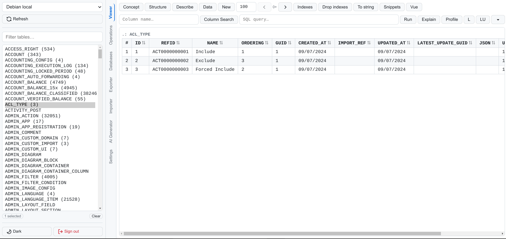

# DB Viewer

Explore databases, browse schemas, run queries, and export data — all from a single web interface. Install with one command, no web server needed.


<p align="center">
  
</p>

A lightweight **web-based database management tool** for developers. Connect to MySQL, PostgreSQL, or MSSQL databases and work with them from a clean, fast interface.

Especially useful for **backend developers and DBAs** who need to quickly inspect schemas, run queries, compare databases, export reports, and generate boilerplate code.

Built with **Python / FastAPI (backend)** and **Vue.js 3 (frontend)**.
Designed to be **self-hosted, simple, and fast**.

> This is a Python rewrite of the [original PHP version](https://github.com/cloudpad9/db-viewer). Same features, much simpler installation.

---

# Install

```bash
curl -fsSL https://raw.githubusercontent.com/cloudpad9/db-viewer-python/main/install.sh | bash
```

This creates a self-contained installation at `~/.dbviewer/` with its own Python virtual environment. No `sudo` required.

The installer will prompt you to create an admin username and password on first install.

Then open a new terminal (or `source ~/.bashrc`) and run:

```bash
dbviewer
```

The app starts at **http://localhost:9876**.

---

# Update

To update to the latest version:

```bash
dbviewer --update
```

Or directly with curl:

```bash
curl -fsSL https://raw.githubusercontent.com/cloudpad9/db-viewer-python/main/update.sh | bash
```

The update script replaces only the application code — your data directory (`~/.dbviewer/data/`) and credentials are preserved. If a systemd service is running, it is stopped before the update and restarted automatically afterward.

---

# Requirements

Python 3.10 or newer. No web server, no PHP, no Node.js.

Check your Python version:

```bash
python3 --version
```

---

# Usage

```
dbviewer [OPTIONS]

Options:
  --host HOST          Bind address (default: 0.0.0.0)
  --port PORT          Port number (default: 9876)
  --data-dir PATH      Data directory (default: ~/.dbviewer/data)
  --no-auth            Disable authentication
  --open               Open browser on start
  --version            Show version and exit
  --change-password    Change a user's password
  --update             Update to the latest version from GitHub
```

Examples:

```bash
# Start on a custom port
dbviewer --port 8080

# Start and open browser
dbviewer --open

# Run without login (trusted network)
dbviewer --no-auth

# Change the admin password
dbviewer --change-password

# Update to latest version
dbviewer --update
```

---

# Features

**Schema Exploration**
— Browse tables across MySQL, PostgreSQL, and MSSQL from a single interface. View table structures, column types, indexes, table sizes, and row counts. Search columns by name or type across selected tables.

**SQL Execution**
— Run arbitrary SQL queries with results displayed as formatted tables. Query autocomplete from table and column names. Query history with recall. Special modes: Explain, Profiling, Last Row, Last Update. Destructive queries require explicit confirmation.

**Data Viewing & Editing**
— View table data with pagination. Edit cells inline by clicking (supported for NAME, TITLE, ALIAS, SHORT_NAME, ORDERING columns). Insert new rows via a dynamic form. Generate and insert fake data for testing.

**Table Operations**
— Rename, clone, truncate, or drop tables. Add, alter, or drop columns. Drop indexes. Visual query builder for common UPDATE/DELETE patterns. All destructive operations support dry-run mode.

**Database Comparison**
— Compare schemas between two database connections. Generate ALTER TABLE patches to sync differences. Copy selected tables or clone entire databases between connections.

**Excel Export**
— Export query results as formatted `.xlsx` files. Configure column titles, decimal formatting, summable columns, center alignment, column widths, and sheet separation. Save and recall report configurations.

**Code Generation**
— Generate Vue.js 3 components (list panel + edit form) from table schemas. Export code snippets, column lists, and boilerplate in multiple formats.

**AI-Assisted Queries** (optional)
— Ask questions in natural language about your data. The AI generates SQL queries based on your schema, executes them, and shows results. Generate form layouts from table schemas.

**Interface**
— GitHub-inspired light theme. Monospace response pane. Tabbed interface (Viewer, Operations, Databases, Exporter, Importer, AI Generator). State persists across page refreshes.

---

# Database Connections

Edit `~/.dbviewer/data/connections.json` to add your database connections:

```json
[
    {
        "name": "My MySQL DB",
        "type": "mysql",
        "server": "localhost",
        "port": 3306,
        "database": "mydb",
        "user": "root",
        "password": "secret"
    },
    {
        "name": "My PostgreSQL DB",
        "type": "postgres",
        "server": "localhost",
        "port": 5432,
        "database": "mydb",
        "user": "postgres",
        "password": "secret"
    }
]
```

Supported database types: `mysql`, `postgres`, `mssql`.

Restart the server after editing connections.

---

# Workflow

A typical workflow:

1. Start `dbviewer` and open it in your browser
2. Select a database connection from the dropdown
3. Browse the table list (shows row counts)
4. Select one or more tables
5. Use the **Viewer** tab to explore structure, run queries, view data
6. Use the **Operations** tab for schema changes
7. Use the **Databases** tab to compare or sync schemas
8. Use the **Exporter** tab to generate Excel reports

---

# Authentication

The app uses token-based authentication with bcrypt-hashed passwords.

1. User logs in with username and password
2. Server creates a session token (valid for 7 days)
3. Token is sent with every subsequent request
4. Sessions auto-expire and are cleaned up automatically

Change the password at any time:

```bash
dbviewer --change-password
```

To disable authentication entirely (e.g. for local-only use):

```bash
dbviewer --no-auth
```

---

# Run as a Service

To keep `dbviewer` running in the background:

```ini
# /etc/systemd/system/dbviewer.service
[Unit]
Description=DB Viewer
After=network.target

[Service]
Type=simple
User=youruser
ExecStart=/home/youruser/.dbviewer/bin/dbviewer --port 9876
Restart=always
RestartSec=5

[Install]
WantedBy=multi-user.target
```

```bash
sudo systemctl daemon-reload
sudo systemctl enable --now dbviewer
```

For a full production setup including Cloudflare Tunnel and custom domain, see [docs/PRODUCTION_SETUP.md](docs/PRODUCTION_SETUP.md).

---

# Data Storage

All data is stored in `~/.dbviewer/data/` as plain JSON files. No database required for the app itself.

| File | Purpose |
|------|---------|
| users.json | User accounts |
| sessions.json | Active login sessions |
| connections.json | Database connection configurations |
| config.json | Optional app settings (AI keys, etc.) |

---

# Project Structure

```
db-viewer-python/
├── install.sh
├── update.sh
├── pyproject.toml
├── README.md
├── LICENSE
├── docs/
│   ├── SPECS_V1.0.md
│   ├── DEV_SETUP.md
│   └── PRODUCTION_SETUP.md
├── src/
│   └── dbviewer/
│       ├── __init__.py
│       ├── __main__.py
│       ├── cli.py
│       ├── server.py
│       ├── config.py
│       ├── auth.py
│       ├── api.py
│       ├── name_helper.py
│       ├── code_generator.py
│       ├── schema_diff.py
│       ├── excel_export.py
│       ├── drivers/
│       │   ├── __init__.py
│       │   ├── base.py
│       │   ├── mysql.py
│       │   ├── postgres.py
│       │   └── mssql.py
│       └── static/
│           └── index.html
└── tests/
```

---

# Documentation

| Document | Description |
|----------|-------------|
| [docs/SPECS_V1.0.md](docs/SPECS_V1.0.md) | Complete technical specification — every feature, API endpoint, and data format |
| [docs/DEV_SETUP.md](docs/DEV_SETUP.md) | Clone the repo, install dependencies, run tests, and manually verify all features locally |
| [docs/PRODUCTION_SETUP.md](docs/PRODUCTION_SETUP.md) | Deploy as a systemd service, expose via Cloudflare Tunnel with a custom domain |

---

# Uninstall

```bash
rm -rf ~/.dbviewer
```

Then remove this line from `~/.bashrc` and/or `~/.zshrc`:

```bash
export PATH="$HOME/.dbviewer/bin:$PATH"
```

---

# Related

This project is a Python rewrite of [db-viewer](https://github.com/cloudpad9/db-viewer) (PHP + Vue.js). Same UI and features, simpler installation.

---

# Contributing

Contributions are welcome.

1. Fork the repository
2. Create a feature branch
3. Submit a pull request

---

# License

MIT License
